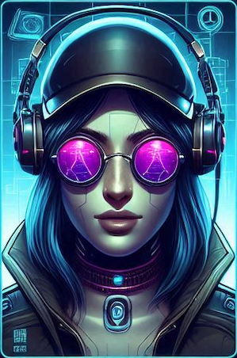

 

 

### Documentation

Javadoc documentation is available in the [doc](doc) folder. To consult it, open [index.html](doc/index.html) in a browser.  

### Class Diagram

[UML.png](UML.png)

## Design Decisions

### User profile management

At the start of the game, the player is given the option to choose an avatar from 4 available options and enter a nickname.  

   
   
   
   

  
 
If the field is left empty or a text longer than 10 characters is entered, a pop-up appears signaling the invalidity of the nickname.
Subsequently, in the top left of the Home screen, the following player information will be visible: selected avatar, nickname, number of games won, lost, and drawn.
  

### Management of a complete game against 1/2/3 artificial players.

On the Home screen, the player has the option to choose whether to start a game with one, two, or three players by clicking on the corresponding card image.  

  

The artificial players follow the same rules as the dealer: they continue to draw cards until they reach a total of 17 points. 

Player 2 and Player 3 are shown on the Home screen, each with a randomly selected avatar, different from the one chosen by the player.
Their number of won, lost, and drawn games is also shown.

During the game, the player has 2 available buttons, to draw a new card or to pass the turn.
`hit` and `stay` buttons, respectively.
By selecting `stay`, the dealer flips the hidden card, and along with the other artificial players, shows the other drawn cards.
The `hit` and `stay` buttons become unselectable, and simultaneously, a message is shown at the center of the screen indicating the outcome of the game.
This is accompanied by a `home` button that allows the player to return to the Home screen.

 

### Betting System

There is an initial amount of `$5000`, visible on the Home screen.

The betting system automatically starts before the game begins.
The selected chips are placed on the board’s center through animation, stacked one on top of the other.
In the top left, the current balance and the bet amount are shown.
If a chip is selected that exceeds the available balance, a pop-up warning appears indicating the impossibility of making that bet.
  

## Design Patterns

### MVC
The code is organized in:
- [Model](src/BlackJack/Model.java), responsible for the game logic and data. It manages the state of the game, including the deck of cards, the dealer's hand, the players' hands, and the results.
- **View**, one for each game mode:
    * [OnePlayer.java](src/BlackJack/views/OnePlayer.java): game with no AI players
    * [TwoPlayers.java](src/BlackJack/views/TwoPlayers.java): game with one AI player
    * [ThreePlayers.java](src/BlackJack/views/ThreePlayers.java): game with two AI players
- [Controller](src/BlackJack/Controller.java) that acts as an intermediary between the model and the view. It manages user actions and updates the model accordingly.

The three game views extend the [GameView](src/BlackJack/GameView.java) interface, which defines abstract methods that are implemented by all the views so that the Controller class can communicate with them.

### Observer/Observable

The Model extends the Observable class, and every time its state changes, it sends a notification to the observers via the `notifyObservers()` method.
 The observers of the model are [OnePlayer.java](src/BlackJack/views/OnePlayer.java), [TwoPlayers.java](src/BlackJack/views/TwoPlayers.java), and [ThreePlayers.java](src/BlackJack/views/ThreePlayers.java). 
These implement the Observer interface and register with the model. When the model changes, the `update()` method is called, allowing the views to reflect the changes.

## GUI

I adopted **Java Swing** for the GUI.
The structure of the interface is centered on a **JFrame**, which represents the main window of the application. I have created several classes that extend **JPanel** to represent the different screens. These are contained in:

* [Start.java](src/BlackJack/views/Start.java): Start screen

* [Home.java](src/BlackJack/views/Home.java): Home screen

* [Bet.java](src/BlackJack/views/Bet.java): Betting phase

* [OnePlayer.java](src/BlackJack/views/OnePlayer.java): Game with no artificial players

* [TwoPlayers.java](src/BlackJack/views/TwoPlayers.java): Game with one artificial player

* [ThreePlayers.java](src/BlackJack/views/ThreePlayers.java): Game with two artificial players

In these, I used Swing elements such as **JButton**, **JLabel**, **JTextField**, etc.
I also used layout managers such as **BorderLayout**, **GridLayout**, and **FlowLayout** for the placement of elements.
User interactions with the interface, such as clicking buttons or entering data in text fields, are handled via listeners that capture the events and trigger the corresponding code to perform the requested operations.

    
    
    
    
    
   

## Stream

In the Model, I used streams to distribute the cards to the player and the bots, and to generate the deck with all possible combinations of suits and values.
In [Bet.java](src/BlackJack/views/Bet.java) (the betting phase), I used streams to speed up the creation of a `Map<Integer, Image>` where the integer is the value of the chip, and the image is the corresponding chip image. From this Map, I used streams to create the **ChipButtons**, i.e., the **ImageButtons** for the chips, which are then drawn in their correct position on the board.
In the views for the 1, 2, and 3 player games, I used streams to update the cards in the hands of the player and the bots.
Streams were also used to update the positions of the cards.
I also used streams in other cases to make the code more compact and efficient.

## AudioManager

Through the **AudioManager** library, I inserted the playback of 4 .wav files in different situations:
* [card.wav](src/BlackJack/resources/audio/card.wav)
* [click.wav](src/BlackJack/resources/audio/click.wav)
* [click2.wav](src/BlackJack/resources/audio/click2.wav)
* [chip.wav](src/BlackJack/resources/audio/chip.wav)

## Animation 

The main animations implemented relate to the movement of the chips during the bets and the distribution of the cards. For the chips, I created a class **MovingCircle**, which has an initial position, a target position, and a total number of frames to complete the animation.
The `update()` method calculates the new position of the chip at each frame.
The animation is managed by a Timer that periodically calls `update()` and redraws the panel.
For the cards, I created an abstract class [AnimationCard.java](src/BlackJack/views/AnimationCard.java) with various subclasses to handle different types of animations of the cards in the 1, 2, and 3 player games.
These perform two types of movement:
* From outside the board to reach their position when drawn
* From their previous position to their next position to make room for the new drawn cards

The animation of the cards follows a similar mechanism to the chips, with the addition that at each update, the cards move one-tenth of the remaining distance to reach the target.
This means that as the distance decreases, the speed with which they move decreases, creating a smooth movement effect.

 

